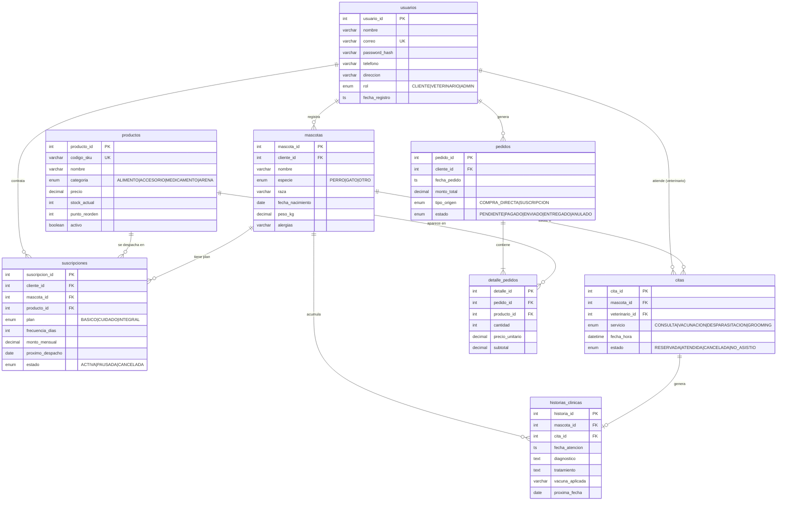

# Modelo de datos — VetPet Connect

Esquema relacional en MySQL 8.0 que soporta los tres pilares del modelo B2C:
comercio electrónico, suscripción recurrente y salud animal.

Script ejecutable: [`basedatos/01_esquema.sql`](../basedatos/01_esquema.sql)

## Diagrama entidad-relación



## Trazabilidad requerimiento → objeto de base de datos

| Requerimiento | Objeto que lo sostiene |
| --- | --- |
| RF-01 Autenticación con roles | `usuarios.rol`, `usuarios.password_hash` (BCrypt) |
| RF-02 Catálogo y carrito | `productos`, `pedidos`, `detalle_pedidos` |
| RF-03 Suscripción mensual | `suscripciones`, `pedidos.tipo_origen` |
| RF-04 Agenda de citas | `citas`, restricción `uk_agenda (veterinario_id, fecha_hora)` |
| RF-05 Historia clínica y alertas | `historias_clinicas.proxima_fecha`, vista `v_recordatorios_salud` |
| RF-06 Inventario en tiempo real | `productos.stock_actual`, `productos.punto_reorden`, `sp_confirmar_pedido`, vista `v_semaforo_inventario` |
| RNF-02 Seguridad | `password_hash VARCHAR(255)` para BCrypt; sin datos de tarjeta en el modelo |
| RNF-03 Concurrencia sin sobreventa | InnoDB, `CHECK (stock_actual >= 0)`, `SELECT ... FOR UPDATE` en `sp_confirmar_pedido` |

## Reglas de integridad implementadas

| Regla | Mecanismo |
| --- | --- |
| Un veterinario no puede tener dos citas a la misma hora | `UNIQUE KEY uk_agenda (veterinario_id, fecha_hora)` |
| Un producto no puede repetirse dos veces en el mismo pedido | `UNIQUE KEY uk_linea_pedido (pedido_id, producto_id)` |
| El stock nunca queda negativo | `CHECK (stock_actual >= 0)` |
| Cada atención genera un único registro clínico | `cita_id` con restricción `UNIQUE` en `historias_clinicas` |
| Al borrar un pedido se borra su detalle | `ON DELETE CASCADE` en `detalle_pedidos` |
| El precio del pedido no cambia si el catálogo cambia | `detalle_pedidos.precio_unitario` guarda el precio histórico |

## Cómo ejecutar los scripts

```bash
mysql -u root -p < basedatos/01_esquema.sql
mysql -u root -p < basedatos/02_datos_prueba.sql
mysql -u root -p < basedatos/03_transaccion_compra.sql
mysql -u root -p < basedatos/04_consultas_ejemplo.sql
```
